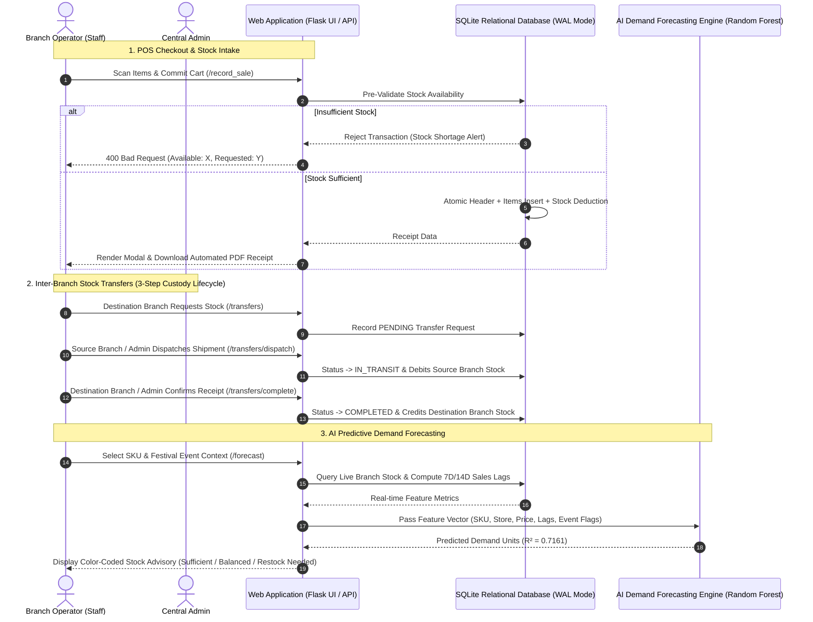

# Noire — Advanced Retail Intelligence & Makeup Inventory Forecasting System

An intelligent, multi-branch retail inventory management, Point of Sale (POS), inter-branch logistics, and AI demand forecasting platform tailored for beauty retailers.

This platform combines Point of Sale transaction processing with machine learning to optimize inventory levels across multiple store locations, mitigate stockouts, manage inter-branch stock rebalancing, and predict future SKU demand using historical baselines and live sales dynamics.

---

## System Architecture & Data Flow



---

## Key Features

### Multi-Branch Architecture (`S001` – `S005`)
* **Branch Isolation**: Manage inventory balances and sales transactions across multiple store branches (`S001` to `S005`).
* **Operator Context Switching**: Admins can seamlessly toggle active branch view; staff accounts are strictly locked to their assigned physical node.
* **Per-Branch Stock Ledgers**: Physical stock tracking, search, multi-attribute filtering, and intake controls isolated by operating node.

### Inter-Branch Stock Transfers & Custody Lifecycle
* **3-Step Custody Lifecycle (`PENDING` → `IN_TRANSIT` → `COMPLETED`)**:
  1. **PENDING**: Destination branch requests stock; inventory availability at the source is pre-validated.
  2. **IN_TRANSIT**: Source branch operator or administrator approves and dispatches stock; source inventory is debited immediately (preventing phantom stock at destination while on the truck).
  3. **COMPLETED**: Destination branch operator or administrator confirms physical receipt; destination inventory is credited.
* **Admin Override Authority**: Administrators possess full override power at any stage to initiate transfers, approve dispatch, confirm physical receipt, or cancel shipments.
* **Reverse Debit on Cancellation**: Cancelling an `IN_TRANSIT` shipment automatically rolls back and restores debited units to the source branch.

### Transaction Terminal (POS)
* **Multi-Item Cart Session**: Staging multiple product items, shades, and quantities in a single checkout session.
* **Pre-Checkout Stock Depletion Guard**: Real-time validation preventing phantom sales and negative stock deductions.
* **Promotions & Promo Codes**: Built-in verification for promo codes (e.g. `FESTIVE10` for 10% off, `VALENTINE15` for 15% off).
* **Automated Audit Logging & PDF Receipts**: Instant client-side PDF receipt generation with receipt archive logging.

### AI-Powered Demand Forecasting Engine
* **Machine Learning Engine**: Powered by a **Random Forest Regressor** trained on 219,300+ historical baseline records merged with live POS sales ($R^2 = 0.7161$).
* **Chronological Time-Series Validation**: Strict chronological train/test split (80% historical past $\to$ 20% future horizon) eliminating look-ahead data leakage.
* **Dynamic Domain Features**:
  1. **Temporal Rolling Lags**: Calculates 7-day and 14-day rolling mean sales for recent demand velocity.
  2. **Economic Ratios**: Computes price-to-inventory ratios to analyze stock turnover speed.
  3. **Promotional Surge Flags**: Models seasonal sales spikes (Dashain, Teej, Tihar, Valentine's Day, Festive Flash Sales, Clearance Events).
* **Actionable Stock Advisory**: Generates specific restock unit recommendations based on predicted demand vs. live branch stock.

### Enterprise Security & Access Controls
* **Role-Based Access Control (RBAC)**: Distinct access tiers for `Admin` (Global Management) and `Staff` (Branch Operations).
* **Backend Authorization Decorators**: `@admin_required` python decorators protecting administrative endpoints (`/admin/manage_users`, `/admin/catalog`).
* **Salted Password Hashing**: Passwords stored using Werkzeug's `scrypt` salted password hashing.
* **Anti-Lockout Protection**: System safeguards prevent deleting or demoting the last active administrator account.

---

## Machine Learning Model Evaluation

| Metric | Random Forest Model Value | Description |
| :--- | :--- | :--- |
| **$R^2$ Score** | **`0.7161`** | Explains 71.61% of total sales variance on unseen future test horizon. |
| **MAE** | **`6.6861` units** | Mean Absolute Error across all SKU demand predictions. |
| **RMSE** | **`9.2312` units** | Root Mean Squared Error penalizing large outlier errors. |
| **Training Records** | **176,700 rows** | Historical partition (`2022-01-01` to `2023-08-12`). |
| **Test Records** | **42,610 rows** | Future out-of-time evaluation set (`2023-08-13` to `2026-08-23`). |
| **Split Strategy** | **Chronological Time-Series** | Strict date-based quantile split ($t_{train} \le 80\% < t_{test}$). |

---

## Technology Stack

| Layer | Technologies Used |
| :--- | :--- |
| **Backend Framework** | Python 3.x, Flask |
| **Database System** | SQLite 3 (WAL Mode Enabled, 11 Normalized Relational Tables) |
| **Machine Learning** | Scikit-learn (`RandomForestRegressor`, `LabelEncoder`), Pandas, NumPy, Joblib |
| **Security & Auth** | Werkzeug (`generate_password_hash`, `check_password_hash`), Custom Decorators |
| **Frontend UI** | HTML5, Tailwind CSS, Space Grotesk & Cormorant Garamond Typography, Chart.js, html2pdf.js |
| **Testing** | Pytest (33 Automated Unit & Integration Tests) |

---

## Database Architecture (`data/noire_retail.db`)

The storage layer uses a normalized **SQLite relational database** operating in **Write-Ahead Logging (WAL) mode** (`PRAGMA journal_mode = WAL;`) for high concurrency and zero-locking reads.

```text
┌──────────────┐     ┌──────────────┐     ┌──────────────┐
│   branches   │───< │    users     │     │  categories  │
└──────────────┘     └──────────────┘     └──────────────┘
       │                                         │
       ├───────────< ┌──────────────┐            ▼
       │             │  inventory   │     ┌──────────────┐
       │             └──────────────┘     │ subcategories│
       │                    │             └──────────────┘
       │                    │                    │
       │                    ▼                    ▼
       │             ┌──────────────┐     ┌──────────────┐
       ├───────────< │   products   │ >───│    brands    │
       │             └──────────────┘     └──────────────┘
       │                    │
       ▼                    ▼
┌──────────────┐     ┌──────────────┐     ┌─────────────────────┐
│ transactions │───< │tx_items      │     │ inventory_transfers │
└──────────────┘     └──────────────┘     └─────────────────────┘
```

### Table Schemas:
1. `branches`: Branch directory (`S001` - `S005`, region, location).
2. `users`: Account credentials, Werkzeug salted hashes, role (`admin`/`staff`), assigned branch.
3. `categories`: High-level taxonomies (`lips`, `face`, `body`, `makeup`).
4. `subcategories`: Sub-taxonomies (`lipstick`, `foundation`, `perfume`, `concealer`, `blush`).
5. `brands`: Master brand directory (`Maybelline`, `MAC`, `Clinique`, etc.).
6. `products`: Master product catalog with SKUs, brand/subcategory references, and base prices.
7. `inventory`: Branch-isolated physical stock balances (`UNIQUE(branch_id, product_id)`).
8. `transactions`: POS checkout header logs (ID, user, branch, promo, total, date).
9. `transaction_items`: Itemized sale lines (product_id, shade, quantity, unit_price, subtotal).
10. `inventory_transfers`: Inter-branch stock transfer requests with states (`PENDING`, `COMPLETED`, `CANCELLED`).
11. `historical_sales`: 219,300+ baseline rows used for time-series ML feature extraction.

---

## Setup & Installation Guide

### 1. Prerequisites
Ensure Python 3.9+ is installed on your system.

### 2. Set Up Virtual Environment & Dependencies

**On macOS / Linux:**
```bash
# Create virtual environment
python3 -m venv .venv

# Activate virtual environment
source .venv/bin/activate

# Install required packages
pip install flask pandas numpy scikit-learn joblib pytest werkzeug
```

**On Windows (PowerShell / Command Prompt):**
```cmd
:: Create virtual environment
python -m venv .venv

:: Activate virtual environment
.venv\Scripts\activate

:: Install required packages
pip install flask pandas numpy scikit-learn joblib pytest werkzeug
```

### 3. Run SQLite Database Migration (ETL)
Migrate the flat CSV datasets into the normalized SQLite database (`data/noire_retail.db`):

```bash
python src/migrate_to_sqlite.py
```

### 4. Train the AI Model
Generate the Random Forest predictive model assets:

```bash
python src/train_model.py
```
*Expected Output:*
```text
Step 1: Querying SQLite database tables...
Step 2: Merging historical baseline with live SQLite transactions...
Dataset successfully connected! Total records ready for AI training: 219310 rows.
------------------------------------------------------------
AI DEMAND FORECASTING - MODEL EVALUATION REPORT
------------------------------------------------------------
Train Set: 176,700 records (2022-01-01 to 2023-08-12)
Test Set:  42,610 records (2023-08-13 to 2026-08-23)
R² Score:  0.7161
MAE:       6.6861 units
RMSE:      9.2312 units
------------------------------------------------------------
Model and encoders serialized successfully to models/
```

### 5. Launch the Web Application
Start the Flask development server:

```bash
python app.py
```
Open your browser and navigate to: `http://127.0.0.1:5000`

---

## System Default Credentials

| Role | Username | Password | Default Branch | Access Level |
| :--- | :--- | :--- | :--- | :--- |
| **Admin** | `admin` | `admin123` | `S001` | Full administrative control (Users, Catalog, Transfers, POS, Ledgers, AI) |
| **Staff** | `staff` | `staff123` | `S001` | Branch operations (POS Checkout, Stock Intake, Transfer Requests, AI Forecasting) |
| **Staff** | `renasha` | `staff123` | `S002` | Branch `S002` operations |

---

## Running Automated Tests

Run the Pytest suite to verify security, database isolation, POS pre-validation, inter-branch transfers, and prediction endpoints:

```bash
pytest tests/test_app.py -v
```

*Expected Result:*
```text
============================= 33 passed in 6.65s =============================
```

---
*Developed for intelligent retail & beauty inventory optimization.*

