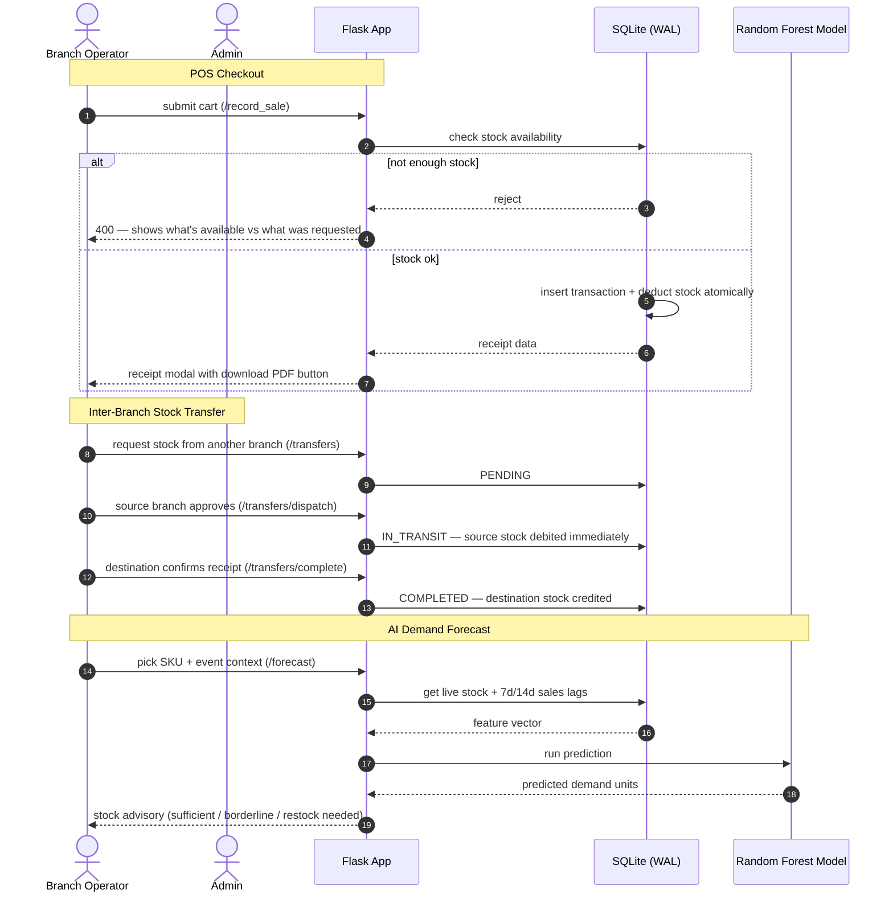

# Noire — Retail Intelligence & Makeup Inventory Platform

A multi-branch retail management system built for beauty stores. Handles everything from POS checkouts and inter-branch stock transfers to AI-powered demand forecasting — all in one place.

Built as part of a university dissertation. The idea was to see if machine learning could actually help a small beauty retail chain manage stock better. Turns out, it can.

---

## What it does

- **Point of Sale** — multi-item cart, promo codes, real-time stock validation, PDF receipts
- **Inventory Ledger** — per-branch stock tracking with low stock alerts (anything under 15 units)
- **Inter-Branch Transfers** — 3-step custody lifecycle: PENDING → IN_TRANSIT → COMPLETED
- **AI Demand Forecasting** — Random Forest model predicts weekly SKU demand using sales lags and festival event context
- **Branch Management** — admin can create new branches; they show up everywhere immediately
- **Discounts & Promos** — create and manage promo codes with percentage-based discounts
- **User Management** — role-based access: admin sees everything, staff is locked to their branch

---

## How it works (system flow)



---

## Model performance

| Metric | Value | What it means |
| :--- | :--- | :--- |
| **R² Score** | `0.7161` | explains 71.6% of sales variance on unseen data |
| **MAE** | `6.69 units` | average prediction error per SKU |
| **RMSE** | `9.23 units` | penalizes large misses more heavily |
| **Training records** | 176,700 rows | historical data up to Aug 2023 |
| **Test records** | 42,610 rows | out-of-time evaluation Aug 2023 → Aug 2026 |
| **Split strategy** | chronological | strict date-based split, no data leakage |

---

## Tech stack

| Layer | What's used |
| :--- | :--- |
| Backend | Python 3.x, Flask |
| Database | SQLite 3, WAL mode, 11 normalized tables |
| ML | scikit-learn (RandomForestRegressor), Pandas, NumPy, Joblib |
| Auth | Werkzeug password hashing, custom decorators |
| Frontend | HTML5, Tailwind CSS, Chart.js, html2pdf.js |
| Typography | Plus Jakarta Sans, Cormorant Garamond |
| Tests | Pytest — 43 unit and integration tests |

---

## Database schema (`data/noire_retail.db`)

SQLite in WAL mode so reads don't block writes. 11 normalized tables:

```
┌──────────────┐     ┌──────────────┐     ┌──────────────┐
│   branches   │───< │    users     │     │  categories  │
└──────────────┘     └──────────────┘     └──────────────┘
       │                                         │
       ├───────────< ┌──────────────┐            ▼
       │             │  inventory   │     ┌──────────────┐
       │             └──────────────┘     │ subcategories│
       │                    │             └──────────────┘
       │                    │                    │
       │                    ▼                    ▼
       │             ┌──────────────┐     ┌──────────────┐
       ├───────────< │   products   │ >───│    brands    │
       │             └──────────────┘     └──────────────┘
       │                    │
       ▼                    ▼
┌──────────────┐     ┌──────────────┐     ┌─────────────────────┐
│ transactions │───< │ tx_items     │     │ inventory_transfers │
└──────────────┘     └──────────────┘     └─────────────────────┘
```

1. `branches` — branch registry (ID, name, region, location, active flag)
2. `users` — credentials, salted hashes, role, assigned branch
3. `categories` — top-level taxonomy (face, lips, body, etc.)
4. `subcategories` — sub-taxonomy (lipstick, foundation, concealer, etc.)
5. `brands` — brand directory (Maybelline, MAC, Clinique, etc.)
6. `products` — master catalog with SKUs and base prices
7. `inventory` — branch-isolated stock balances, unique per (branch, product)
8. `transactions` — POS checkout headers (branch, user, promo, total, date)
9. `transaction_items` — line items per checkout (product, shade, qty, price)
10. `inventory_transfers` — transfer requests with PENDING/IN_TRANSIT/COMPLETED states
11. `historical_sales` — 219,300+ baseline rows for ML feature extraction

---

## Setup

### Prerequisites
Python 3.9+ required.

### Install dependencies

**macOS / Linux:**
```bash
python3 -m venv .venv
source .venv/bin/activate
pip install flask pandas numpy scikit-learn joblib pytest werkzeug
```

**Windows (PowerShell):**
```powershell
python -m venv .venv
.venv\Scripts\activate
pip install flask pandas numpy scikit-learn joblib pytest werkzeug
```

### Migrate the database
Loads the CSV datasets into the normalized SQLite schema:
```bash
python src/migrate_to_sqlite.py
```

### Train the model
Generates the Random Forest model and saves it to `models/`:
```bash
python src/train_model.py
```

Expected output:
```
Dataset ready: 219,310 rows
Train: 176,700 records | Test: 42,610 records
R²: 0.7161  |  MAE: 6.6861  |  RMSE: 9.2312
Model saved to models/
```

### Weekly retraining
No scheduled task needed. On the first login every Sunday, the app kicks off a background retraining job using the latest sales data. Staff can keep using the system while it runs. If it fails, the previous model stays active and it'll retry next Sunday.

### Run the app
```bash
python app.py
```
Open `http://127.0.0.1:5000` in your browser.

---

## Default credentials

| Role | Username | Password | Branch |
| :--- | :--- | :--- | :--- |
| Admin | `admin` | `admin123` | S001 |
| Staff | `staff` | `staff123` | S001 |
| Staff | `renasha` | `staff123` | S002 |

---

## Tests

```bash
pytest tests/test_app.py -v
```

Covers: auth, stock isolation, POS pre-validation, transfers, discounts, forecasting, and branch management.

```
43 passed in ~8s
```

---

*built by renasha dahal — dissertation project, 2026*
